### Bug Reports on Saucedemo

##### Bug\_id:SD\_01

**Title:** All products display the same picture on inventory page.

**Description:**

After log in as **problem\_user**, the system displays the same product image for all products on the inventory page.

**Steps to Reproduce:**

1\. Go to saucedemo url "https://www.saucedemo.com/"

2\. Login as problem\_user

3\. Observe the product pictures on inventory page

**Expected results:** Each product should display its attached product image

**Actual results:** The same product image is displayed for all products on the inventory page.

**Evidence:**
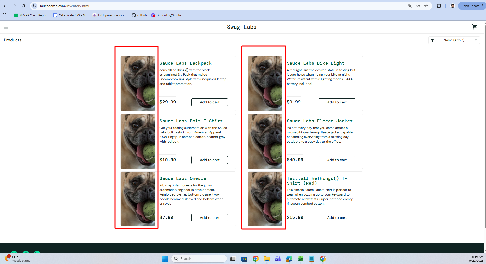

**Severity:** Medium

**Priority:** High

\---

##### Bug\_id:SD\_02

**Title:** Error message text is overlapped with its boundary

**Description:**

When a invalid credential is submitted on the login page, the Error message text is overlapped/clipped with its boundary.

**Steps to Reproduce:**

1\. Go to saucedemo url "https://www.saucedemo.com/"

2\. Login with an invalid credential
3. Observe the error text.

**Expected results:**

1. The error text field should handle the error message properly without any overlapping/clipping
2. The cross (x) icon should be properly aligned in the error field

**Actual results:**

1. Error text is overlapped with its boundary
2. The cross (x) icon is misaligned in the field

**Evidence:**
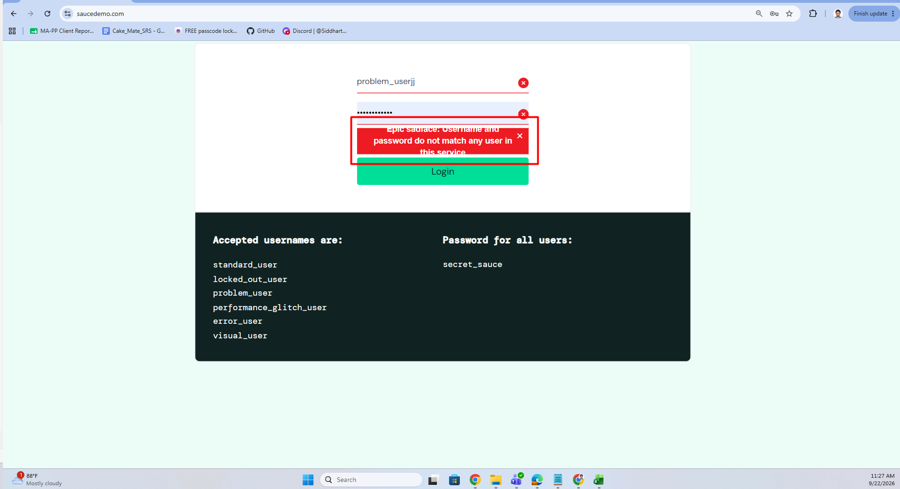

**Severity:** Low

**Priority:** High

\---

##### Bug\_id:SD\_03

**Title:** Products sorting/filtering is not working properly

**Description:**

When log in as problem\_user, sorting options like name (z to a), price (low to high) and Price (high to low) are not applied on the product items.

**Steps to Reproduce:**

1. Login as problem\_user and navigate to the saucedemo inventory page

2\. Click on the filter icon

3\. Select the sorting option - Name (Z to A)
4. Observe that products are not sorted accordingly

5\. Select the sorting option - Price (low to high)
6. Observe that products are not sorted accordingly

7\. Select the sorting option - Price (high to low)
8. Observe that products are not sorted accordingly

**Expected results:**

For any authorized user, sorting options should be applied to the product accordingly:

&#x20;  i. Name (A to Z): Ascending alphabetical order

&#x20;  ii. Name (Z to A): Descending alphabetical order

&#x20;  iii. Price (low to high): Ascending price order

&#x20;  iv. Price (high to low): Descending price order

A**ctual results:** Filter is not applied to the non-default sorting options - name (z to a), price (low to high) and Price (high to low)

**Evidence:**
.png)
.png)
.png)

**Severity:** High

**Priority:** High

\---

##### 

##### Bug\_id:SD\_04

**Title:** 'Add to cart' function is not working for few items.

**Description:**

After log in as problem\_user, 'Add to cart' is not working for few of the items.

**Steps to Reproduce:**

1. Login as problem\_user and navigate to the saucedemo inventory page

2\. Select a product (example: Sauce Labs Bolt T-Shirt)

3\. Click on Add to cart

4\. Observe that button state is not changed to 'Remove'/added to cart for the mentioned product.

**Expected results:**

1. After clicking on 'Add to cart' for **any items**, the selected item should be added to cart for any authorized user.
2. Button state should be changed to 'Remove' for the selected item

**Actual results:** For few items, the product is not added to the cart.

**Evidence:**
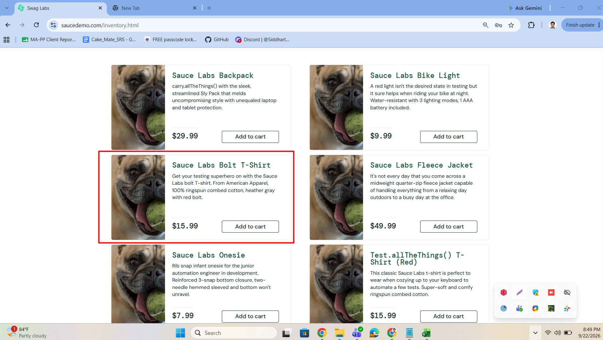

**Severity:** High

**Priority:** High

\----

##### Bug\_id:SD\_05

**Title:** User is redirected to different product's page

**Description:**

After log in as problem\_user, when the user clicks on a product's name or image, it redirects the user to an incorrect product details page instead of the selected product.

**Steps to Reproduce:**

1. Login as problem\_user and navigate to the saucedemo inventory page

2\. Select a product

3\. Observe that it redirects the user to an incorrect product details page instead of the selected product.

**Expected results:**

After login as any user, clicking on any product's name or image, user should be redirected to the corresponding product's details page.

**Actual results:** User always redirects to different product's page

**Evidence:**
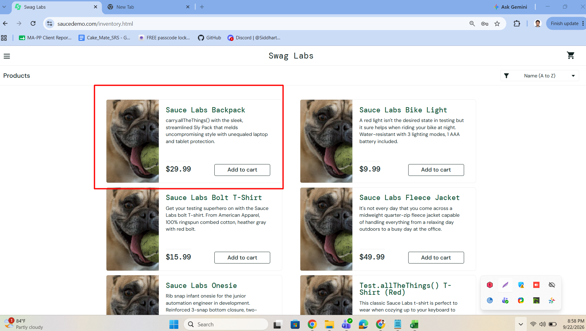
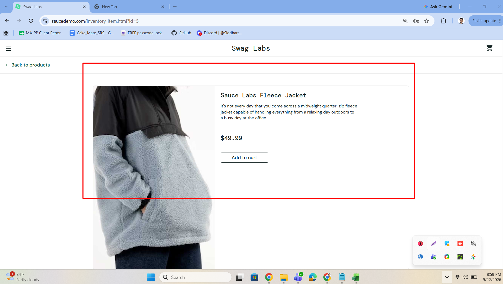

**Severity:** High

**Priority:** High

\---

##### Bug\_id:SD\_06

**Title:** 'Remove' function is not working on Inventory and product details page

**Description:**

After log in as problem\_user, 'Remove' function is not working after adding a item to the cart

**Steps to Reproduce**:

1. Login as problem\_user and navigate to the saucedemo inventory page

2\. Select a product

3\. Click on Add to cart

4\. Try to remove the item from inventory page or product details page
5. Observe that product is not removed from the cart

**Expected results:**

1. The product is removed from the cart.

2\. The button text changes back from Remove to Add to cart.

3\. The cart icon counter decreases by 1.

**Actual results:** Product is not removed from the cart

**Evidence:**
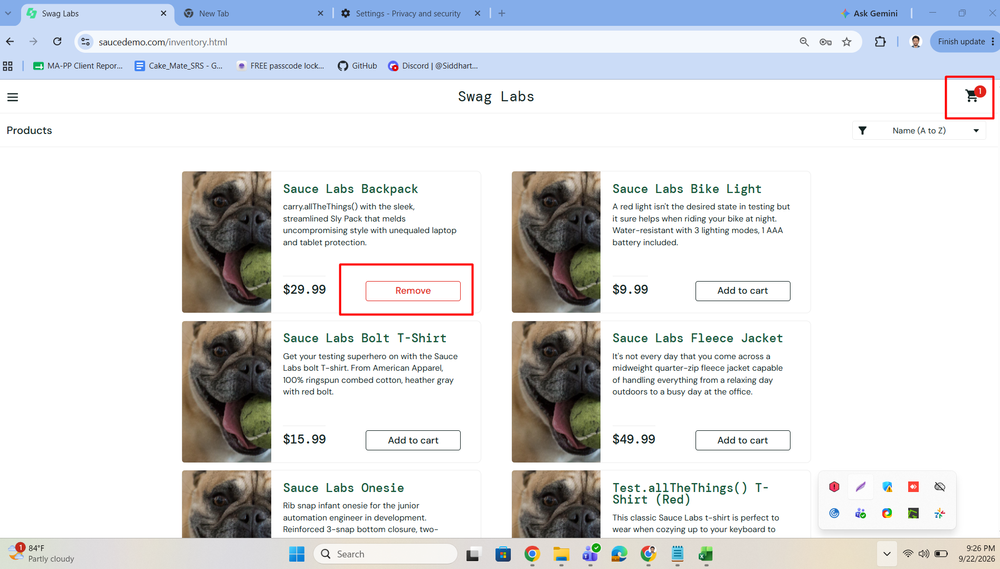

**Severity:** High

**Priority:** High

\---

##### Bug\_id:SD\_07

**Title:** cart items are not synced for same user accross different browser

**Description:**
When log in into the application with the same user credentials but on different browser, the items already added to the cart do not sync based on the user account.

**Steps to Reproduce:**

1. Open browser A, login with an user and navigate to the saucedemo inventory page

2\. Add few items to the Cart

3\. Observe the cart count on the cart page
4. Open Browser B and login with the same credentials
5. click on the cart icon

6\. Observe that previously added product are not showing for the same user in different browser.

**Expected results:** Items added on the cart should be saved based on user account

**Actual results:** Items added on the cart are saved based on browser session.

**Evidence:**
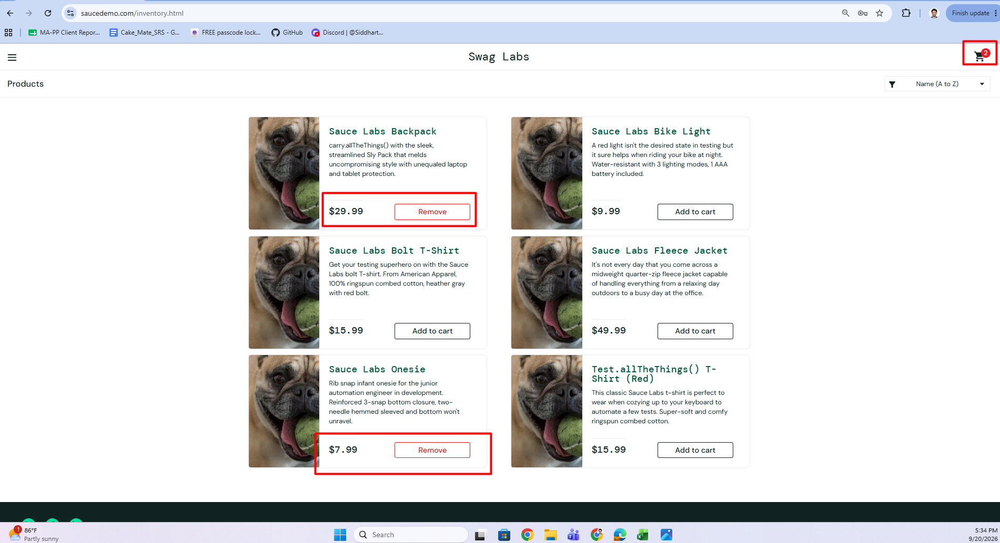
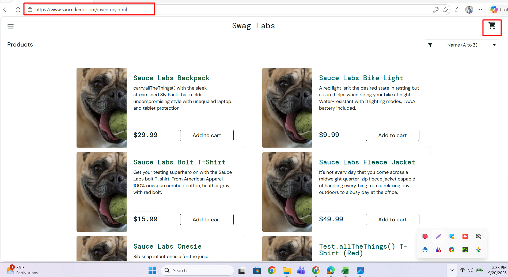

**Severity:** High

**Priority:** Medium

\---

##### Bug\_id:SD\_08

**Title:** Product Details Page displays incorrect data and invalid price for Item ID 6

**Description:**
After login as problem\_user, Product Details Page for Item ID 6 displays incorrect data like a dog image for an jacket item, 'item not found' on the title, call instruction text and an invalid format for price

**Steps to Reproduce:**

1. Login as problem\_user and navigate to the saucedemo inventory page
2. click on the Sauce Labs Fleece Jacket

3\. Observe the product title, description, image and price

**Expected results:**

1. For any user, Product details page should display the correct title, description, price and image.

2\. If item is not available, it should handle with different field instead of the title field

**Actual results:**

1. Title displays as 'item not found'. Description and image are not related to the product

2\. Price field contains root operator.

**Evidence:**
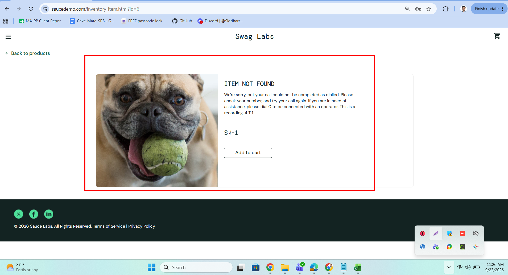

**Severity:** High

**Priority:** High

\---

##### Bug\_id:SD\_09

**Title:** checkout is allowed with empty cart

**Description:**
When the cart is empty but user tries to 'Checkout', then user is allowed to proceed to the next screen without any error message.

**Steps to Reproduce:**

1. Login and navigate to the saucedemo inventory page
2. Do not add any items to the Cart

3\. Go to the cart and click on checkout button

4\. Observe that no error message is shown to the user.

**Expected results:** While checkout with an empty cart, an error message should be displayed to the user indicating the cart is empty

**Actual results:** Error message is not displayed to the user indicating the cart is empty

**Evidence:**
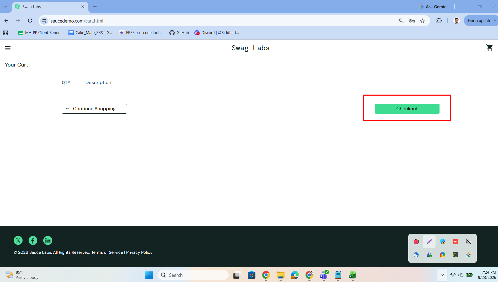
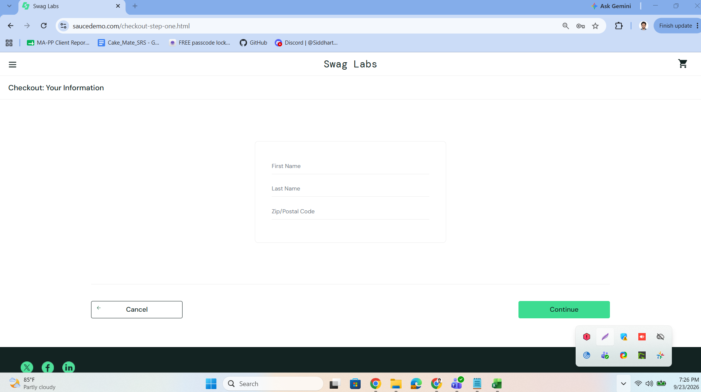

**Severity:** Low

**Priority:** Low

\---

##### Bug\_id:SD\_10

**Title:** Checkout flow is blocked since last name field is not accepting user input

**Description:**
After login as problem\_user, while Doing the checkout process, the 'Last Name' field does not accept user input and hence preventing the users to continue to the next page.

**Steps to Reproduce:**

1. Login as problem\_user and navigate to the saucedemo inventory page
2. Add any items to the Cart

3\. Go to the cart and click on checkout button

4\. Try to fill the last name field

5\. Observe that the last name field is not taking any input

**Expected results:** Any user should be able to fill the last name field and continue to the next page

**Actual results:** User is unable to enter any data on Last name field and fails to continue to the next page

**Evidence:**
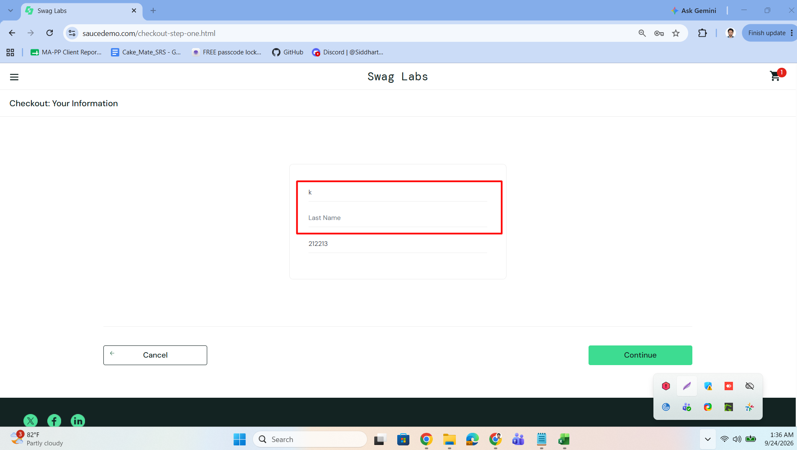
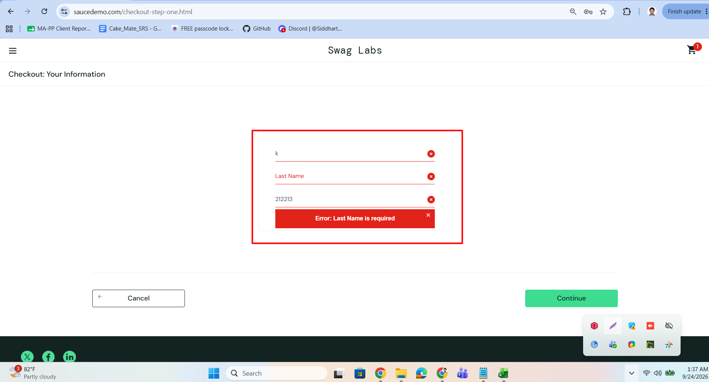

**Severity:** High

**Priority:** High

